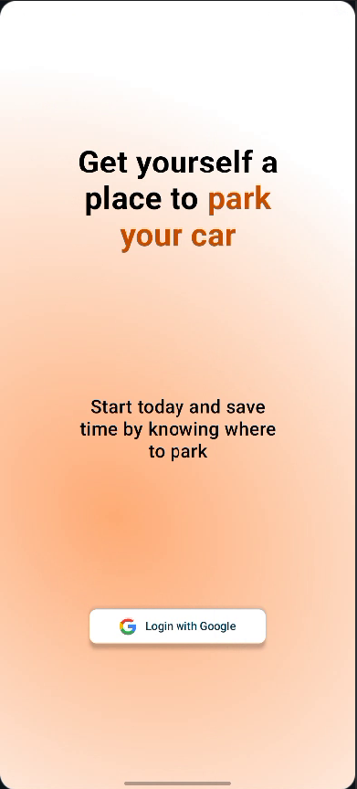
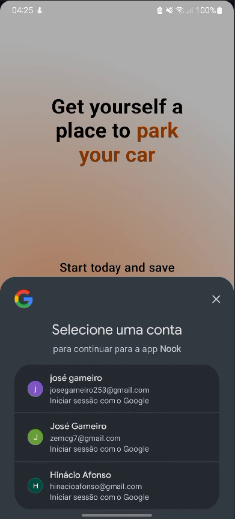

# Mobile App

For the mobile app we decided to implement the following main features:

- Authentication with *Google*
- See nearby Parking Lots
- See Parking Lot details
- Define a new location to obtain the nearby Parking Lots

## 1. Authentication with Google

    
    

